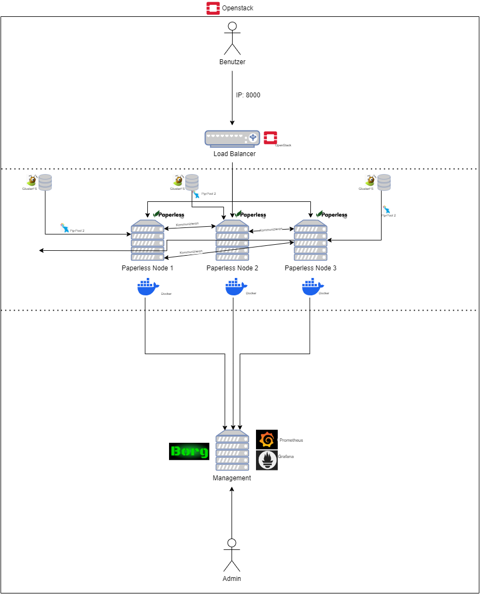

# Betriebshandbuch (BHB) - Paperless NGX Cloud Services

## 1. Kurzbeschreibung
Das Paperless NGX System dient als digitale Dokumentenverwaltungslösung, die auf einer Cloud-Infrastruktur in OpenStack basiert. Die Anwendung besteht aus mehreren Instanzen, die zur Lastverteilung und Skalierbarkeit dienen. Monitoring wird durch Prometheus und Grafana gewährleistet.

## 2. Beteiligte und Zuständigkeiten
- **Systemadministratoren:** Jannis Fingerhut (jannis.fingerhut@informatik.hs-fulda.de), Atharva Kishor Naik (atharva-kishor.naik@informatik.hs-fulda.de)
- **Entwicklungsteam:** Jannis Fingerhut (jannis.fingerhut@informatik.hs-fulda.de), Atharva Kishor Naik (atharva-kishor.naik@informatik.hs-fulda.de)
- **Support-Team:** Jannis Fingerhut (jannis.fingerhut@informatik.hs-fulda.de), Atharva Kishor Naik (atharva-kishor.naik@informatik.hs-fulda.de)

## 3. Architektur

Das System umfasst:
- 3 Paperless NGX Instanzen (node1, node2, node3) für Lastverteilung.
- 1 Management-Instanz zur Steuerung und Überwachung.
- OpenStack-Netzwerkumgebung mit definierten Sicherheitsgruppen und Floating IPs.
- Datenbank (PostgreSQL) und Message Broker (Redis) in Containern.
- Monitoring mit Prometheus und Grafana.

## 4. Installation
- Bereitstellung der VMs über Terraform.
- Automatisierte Konfiguration mit Bash-Skripten (`paperless.sh`, `nodeX.sh`, `mgmt.sh`).
- Docker-Container für Paperless NGX starten mit `docker-compose up -d`.

## 5. Konfiguration
- Paperless NGX-Umgebungskonfiguration (Über `docker-compose.env`).
- Netzwerkkonfiguration mit festen IPs in OpenStack.
- Sicherheitsgruppen erlauben nur notwendige Ports (z.B. `8000` für Paperless, `22` für SSH).

## 6. Abhängigkeiten
- **Netzwerk:** OpenStack definiert Subnetze und Router.
- **Storage:** PostgreSQL-Datenbank speichert Dokumentendaten.
- **Server:** Virtuelle Maschinen laufen auf OpenStack.

## 7. Monitoring / Überwachung / Logging
- **Prometheus:** Sammelt Metriken von Paperless NGX und den Nodes.
- **Node Exporter:** Systemmetriken (CPU, RAM, Speicher).
- **Grafana:** Visualisierung der Daten mit Dashboards.
- **Logs:** Paperless-Logs befinden sich in `/var/log/paperless/`.

## 8. Wartungsaufgaben
- Wöchentliche Systemupdates (`apt update && apt upgrade -y`).
- Kontrolle der Container-Logs (`docker logs <container>`).
- Überwachung der Metriken und Alerts aus Prometheus.

## 9. Backup / Restore / Failover / Disaster Recovery
- Automatische Backups der PostgreSQL-Datenbank mittels `pg_dump`.
- Dokumenten-Backups auf externem Storage (`/mnt/backup/`).
- Test der Wiederherstellung alle 3 Monate.

## 10. Troubleshooting
- **Paperless NGX nicht erreichbar:** `docker ps` prüfen, ob Container laufen.
- **Hohe CPU-Auslastung:** Prometheus-Metriken überprüfen.
- **Netzwerkprobleme:** `ping nodeX` testen.

## 11. Authentifizierung, Autorisierung, Accounting, Identity Management
- Nutzerverwaltung erfolgt in Paperless NGX.
- Zugriffsschutz durch OpenStack-Sicherheitsgruppen.

## 12. Benutzergruppen und Benachrichtigung
- **Admins:** Vollzugriff auf das System.
- **Benutzer:** Zugriff auf das Paperless-Webinterface.

## 13. Skalierung und Ausfallsicherheit
- Zusätzliche Paperless NGX-Instanzen können per Terraform bereitgestellt werden.
- Hochverfügbarkeit durch verteilte Instanzen auf verschiedene Server.
